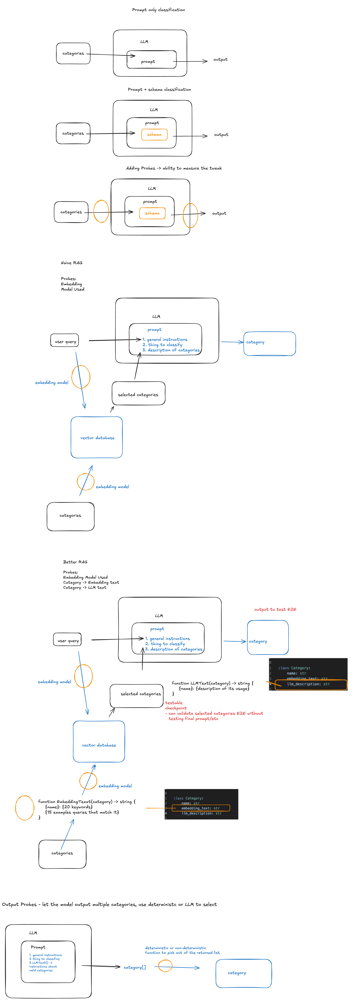

# 🦄 large scale classification

## category-first routing architecture 

### 1. The Core Problem: Lack of Observability (Probes)

*   **The Struggle with Scale:** LLM pipelines face performance degradation when asked to classify over 100 categories. This is particularly true in areas like regulatory documents, manufacturing, and managing tools in an mCP server (often over 1,000 tools).
*   **The Black Box Issue:** The biggest problem is that these systems are not "probed" (non-probable), making them hard to edit and debug.
*   **Waiting for Models:** Without probes, developers are left relying on the model vendor to release new, better versions (e.g., "GPT-26").
*   **Prompt Tweaking is Hard:** Tweaking just the prompt is difficult, especially as prompts get longer, because individual manipulations are more likely to "poison" the output and affect other scenarios.
*   **The Naive Solution:** The simplest approach is putting a list of categories directly into the prompt and hoping the LLM picks correctly, but this is unreliable at scale.
*   **The Definition of a Probe:** Probes are detection points—like those used in circuit design—that allow manipulation and measurement of inputs/outputs within the system.

### 2. The Proposed Architecture: Vector Database Pruning

To address the lack of control, the proposed architecture introduces a filtering layer before the LLM:

1.  **Category Storage:** The massive category list is stored in a Vector Database (DB).
2.  **User Query Embedding:** The user query is embedded and used to search the Vector DB.
3.  **Category Narrowing:** The search returns a smaller, more relevant list of categories (the "selected categories").
4.  **LLM Selection:** Only this narrowed list is passed to the LLM for the final classification.

This approach is successful because LLMs perform better on a smaller number of categories, especially when those categories are disjoint (less overlap).

### 3. Key Probes (Control Points) Introduced

The architecture provides three primary control points to manipulate the system for better accuracy and reliability:

| Probe Name | What It Controls | Mechanism | Introspection/Debugging |
| :--- | :--- | :--- | :--- |
| **Probe 1 (Top K)** | The number of categories returned from the Vector DB. | Determines the count of results from the vector search. | If the desired category isn't in the Top K for a given query, the developer knows to adjust K or modify Probe 2. |
| **Probe 2 (Embedding Text)** | The semantic vector generated for each category. | Instead of embedding the raw category name, a custom function generates rich text (e.g., 15 examples, 20 keywords/scenarios) that is then embedded. | This allows the developer to force the embedding vector to be semantically closer to the user query, which is faster than fine-tuning the embedding model. |
| **Probe 3 (LLM Prompt Text)** | The descriptive text shown to the LLM. | A separate function (`LM text`) generates the text used in the prompt. This recognizes that the optimal text for vector embedding may be different from the optimal text for the LLM to choose from. | This controls the LLM's final decision without poisoning the embedding layer. |

### 4. Implementation and Engineering Insights

*   **Handling Overlap:** The system can be designed to allow the LLM to select multiple valid categories first, and then a subsequent method (or another LLM) can prune that list down to a single best category. This intermediate step is easy to unit test in isolation.
*   **Pruning Flexibility:** The "narrow down categories" step doesn't require a Vector DB; it could be implemented using small models that act as boolean classifiers to determine relevance.
*   **Latency Advantage:** This architecture improves latency. Narrowing categories with a Vector DB (which can be fast, even in-memory for less than 100k categories) is quick. More importantly, passing fewer categories (e.g., 20 vs. 500) to the LLM results in faster response times because LLM latency scales non-linearly (quadratically/exponentially) with input token count.
*   **Dynamic Enums:** Using dynamically built enums (like those provided by BAML) guarantees that the LLM's output is reliably parsed and returned as one of the allowed category objects, regardless of minor textual errors, which is crucial for building a reliable pipeline.
*   **Alias Strategy:** Using an alias (like K0, K1) in the prompt instead of the raw category name allows the LLM to focus all its attention on the custom category description (Probe 3), preventing similar or confusing category names from influencing the result.
*   **Debugging and Evals:** By tracing the system (like stepping through code), developers can quickly determine if a failure occurred in the `narrow down categories` step (embedding/Top K issue) or the `pick best category` step (LLM/prompting issue). The best evaluation method is collecting data from real user queries and seeing if the suggested action based on the classification was rejected by the user.

***

If cat A and B overlap it becomes hard to pick the right ones, will not perform well.

